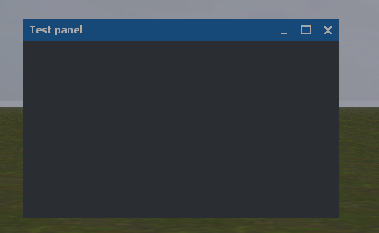
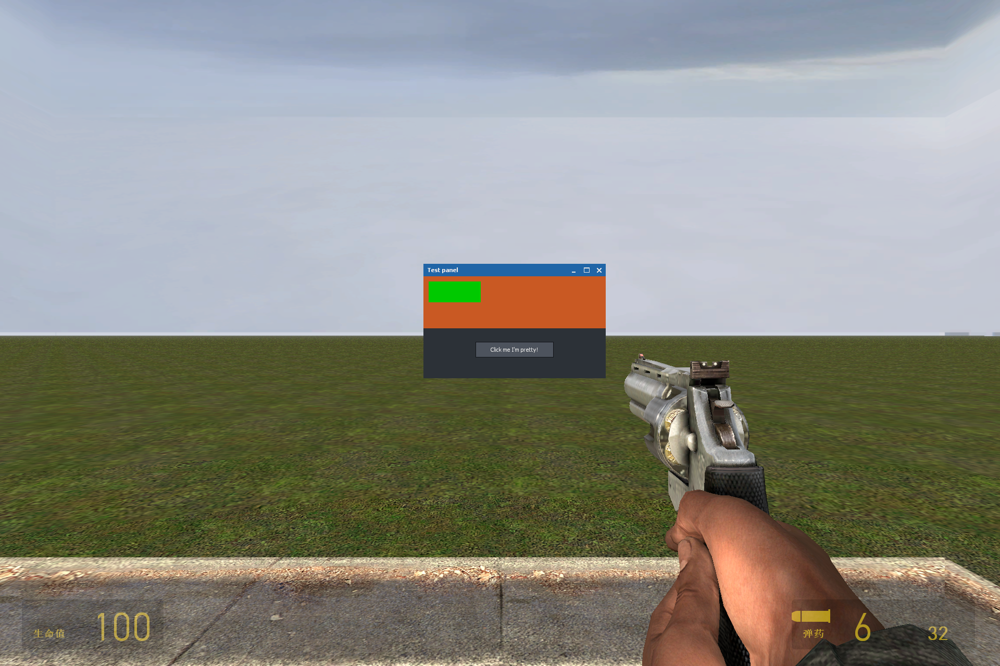

# HL2SB Derma 基础指南

> 对照 [GMod Derma Basic Guide](https://wiki.facepunch.com/gmod/Derma_Basic_Guide) 写的 HL2SB 版本。
> 相同的地方不再重复解释，**不同的地方、这个 fork 的坑、以及"为什么"** 都标了 ⚠️。
> 本文里的每一条都是在本仓库实测过的（引擎源码位置 / 控制台输出 / 截图）。

---

## 0. 运行环境（和 GMod 不一样的第一件事）

GMod 里你在控制台敲 `lua_run`，或者把文件丢进 `lua/autorun/`。HL2SB 的命令是：

| 命令 | 作用 | 注意 |
|---|---|---|
| `lua_run_cl <一行代码>` | 客户端执行一段 Lua | **参数是本行剩余的全部内容**，所以一条命令只能放一句；多句用 `;` 拼在一行里 |
| `lua_dofile <文件>` / `lua_dofile_cl <文件>` | 执行服务端 / 客户端 Lua 文件 | 路径**相对 `lua/` 根目录**、**要带 `.lua`**、**不要写 `lua/` 前缀** |
| `lua_dostring_cl <字符串>` | 同 `lua_run_cl` | — |

⚠️ **不要一次粘贴多行命令**：控制台会把后面几行当成第一条命令的参数。
反例（真实报错）：
```
lua_dofile_cl skins/hl2sb_default.lualua_run_cl for k,p in pairs(vgui.GetAll()) do ...
[Lua] FAILED ...\lua\skins\hl2sb_default.lualua_run_cl for k,...: No such file or directory
```
正确写法是每条一行：
```
lua_dofile_cl skins/hl2sb_default.lua
lua_dofile_cl hl2sb_test_window.lua
```

⚠️ 还没进地图时 `lua_run_cl` 会报 `Lua is not initialized yet (enter a map first)`。

---

## 1. 第一个窗口（GMod 指南第 1 节的原文，在 HL2SB 里已验证可直接用）

```lua
local Frame = vgui.Create( "DFrame" )
Frame:SetPos( 5, 5 )
Frame:SetSize( 300, 150 )
Frame:SetTitle( "Name window" )
Frame:SetVisible( true )
Frame:SetDraggable( false )
Frame:ShowCloseButton( true )
Frame:MakePopup()
```

控制台怎么跑（选一种）：
```
lua_run_cl local f=vgui.Create("DFrame") f:SetPos(5,5) f:SetSize(300,150) f:SetTitle("Name window") f:SetVisible(true) f:SetDraggable(false) f:ShowCloseButton(true) f:MakePopup()
```
或者写进文件 `lua/myframe.lua` 后 `lua_dofile_cl myframe.lua`。

这段代码用到的 7 个方法在 HL2SB 的绑定位置（都在，缺哪个会报 `attempt to call a nil value (method 'x')`）：

| 方法 | 绑定位置 |
|---|---|
| `SetPos` / `SetSize` / `SetVisible` / `MakePopup` | `public/lua/vgui_controls/lPanel.cpp` |
| `SetTitle` | `game/client/lua/scripted_controls/lFrame.cpp` |
| `SetDraggable` / `IsDraggable` / `ShowCloseButton` | `lFrame.cpp`（引擎 `Frame` 元表上的别名：→ `SetMoveable` / `IsMoveable` / `SetCloseButtonVisible`） |

---

## 2. ⚠️ HL2SB 的 DFrame 是「纯 Lua 控件」，不是引擎的 C Frame

GMod 的 `DFrame` 基于引擎的 `EditablePanel`/`Frame`；**HL2SB 的 `DFrame` 完全用 Lua 写**（`lua/vgui/DFrame.lua`，文件头注释就写了 "Built on the scripted Panel rather than the engine's C Frame"），因为本 fork 的 `LFrame` 没有 `ApplySchemeSettings` 的 Lua 分发、关闭按钮由 C++ 持有。

这带来三个必须记住的后果：

1. **chrome（标题栏/按钮/拖动）都在 `lua/vgui/DFrame.lua` 里**：
   `Init` 建 `m_pCloseButton` / `m_pMinimizeButton` / `m_pMaximizeButton` / `m_pBody`，
   `PerformLayout` 从右往左排三个按钮，`Paint` 走 skin 的 `Frame` / `FrameTitle`。
   想改窗口外观 → 改这个文件 + skin，**不要**去改引擎 `Frame`。
2. **引擎 `Frame` 元表上的方法对 DFrame 无效**（它走 Panel 元表）。所以
   `SetDraggable` / `ShowCloseButton` 这类 GMod 方法在 `DFrame.lua` 里**各有一份 Lua 实现**。
3. **内容要放在客户端区域**：`DFrame:GetClientArea()` 返回 `0, 24, w, h-24`，子面板的 `y` 要从 **24**（标题栏高度）起：
   ```lua
   local pnl = vgui.Create( "DPanel", Frame )
   pnl:SetPos( 0, 24 )
   pnl:SetSize( Frame:GetWide(), Frame:GetTall() - 24 )
   ```

### DFrame 现有 API

| 方法 | 说明 |
|---|---|
| `SetTitle` / `GetTitle` | 标题 |
| `GetClientArea` | 内容区 `0, 24, w, h-24` |
| `SetDraggable(b)` / `IsDraggable()` | 是否可拖标题栏（GMod 默认**可拖**） |
| `ShowCloseButton(b)` / `IsCloseButtonVisible()` | `✕` |
| `SetMinimizeButtonVisible(b)` / `SetMaximizeButtonVisible(b)` / `IsMinimizeButtonVisible()` / `IsMaximizeButtonVisible()` | 默认**隐藏**（和 GMod 一样），要显式打开 |
| `Minimize()` / `Restore()` / `Maximize()` / `IsMaximized()` | `—` / `□` / `❐` 的行为 |
| `SetSizable` / `SetDeleteOnClose` / `SetTitleBarVisible` / `SetMinimizeButtonVisible`… | 指南/插件常用的其它 chrome 方法 |
| `Close()` | 隐藏 + 可选 `Remove()`，会分发 `self.OnClose` |
| `ShowMinimizeButton` / `ShowMaximizeButton` | GMod 12 老拼写，保留 |

---

## 3. ⚠️ 覆盖 `Paint` 的坑（本仓库实测）

给**容器类**面板（`DFrame`、`DPanel`）覆盖 `Paint` 之后，它的**子面板会完全不绘制**：

```lua
-- 实测：这样写，frame 自己的红框画出来了，但 body/label/button/标题栏按钮 一个都不画
Frame.Paint = function( s, w, h )
    surface.DrawSetColor( 255, 0, 0, 255 )
    surface.DrawOutlinedRect( 0, 0, w, h )
end
```
对照实验（不覆盖 `Paint`，只挂子面板）→ 橙色块、绿色块、按钮、标题栏按钮**全部正常**。

**结论 / 用法**：
- 想在容器上画装饰，**优先不要覆盖 `Paint`**；用**子面板**来画，或改 skin 的 `SKIN:Paint*` 钩子；
- 一定要覆盖时，记住它会把整棵子树吃掉 —— 目前这是引擎侧 `LPanel::Paint`（`game/client/lua/scripted_controls/lPanel.cpp:88`）与子面板遍历之间的关系问题，尚未修。

---

## 4. 字体：⚠️ 不要遮蔽 scheme 里的字体（Marlett 那一课的完整版）

窗口右上角那三个按钮 `—` `□` `✕` 用的是 **Marlett** 字体（GMod 的默认皮肤同样如此），字形是：
`r` = 关闭、`0` = 最小化、`1` = 最大化、`2` = 还原。

HL2SB 里 **`resource/clientscheme.res` 已经定义了它**，而且带符号字符集：
```
"Marlett" { "1" { "name" "Marlett"  "tall" "14"  "weight" "0"  "symbol" "1" } }
```
字体文件也在：`resource/marlett.ttf`。

⚠️ **千万不要**再写 `surface.CreateFont( "Marlett", { … } )` —— `surface.SetFont(名字)` 的解析顺序是
**「Lua 注册的字体 → 方案(scheme)字体」**，你自己建的那份会**顶掉** scheme 里好的那份；一旦它解析失败，
引擎会**静默回落 Verdana**，屏幕上的图标就变成字母 `0 1 r`（本仓库踩过，已修）。

正确的用法（skin 里现在就是这么写的）：
```lua
local font = "Marlett"           -- 直接用 scheme 里的名字
derma.DrawText( font, x, y, "r", Color( 230, 230, 230, 255 ) )
```

引擎侧的配套加固（`public/lua/vgui/LISurface.cpp`，已编译部署）：
`surface.CreateFont` 失败时不再静默换字体 —— 先去抗锯齿 / `weight 400` 重试一次，
仍失败才 `Warning` 点名（字体名、字号、字重），日志里能直接看到。

其它字体约定：
- 皮肤/方案字体：`DermaDefault`、`DermaDefaultBold`、`DermaLarge`（`lua/includes/modules/gmod_vgui.lua` 里按 GMod 的 `derma/init.lua` 建好的）；
- 自建字体：`surface.CreateFont( name, fontData )`，`fontData` 用 GMod 字段（`font`/`size`/`weight`/`antialias`/`extended`/`shadow`/…）；`extended` 在本引擎里是 no-op（`0,0` 才是对的，见 `AGENTS.md` §5.4）；
- 要**按名字**取句柄：`surface.SetFont(name)` / `draw.GetFont(name)`；`surface.GetTextSize( name, text )`（本仓库的实现要 `(font, text)` 两参数）。

---

## 5. 皮肤（skin）系统

- 皮肤文件：`lua/skins/hl2sb_default.lua`，用 `derma.DefineSkin( "HL2SBDefault", "...", SKIN )` 注册；
- 钩子函数名 = `"Paint" .. Hook`：`PaintFrame` / `PaintFrameTitle` / `PaintCloseButton` / `PaintMinimizeButton` / `PaintMaximizeButton` / `PaintSlider` / …
- 面板里调用：`derma.SkinHook( "Paint", "Frame", self, w, h )`
- 颜色集中在该文件顶部的表里（`FrameTitle`、`FrameTitleIdle`、`Background`、`Text`…），改配色改那里。
  当前 `FrameTitle = Color( 37, 101, 166 )`（蓝色）；想跟 GMod 默认皮肤的灰色一致就改这一行。
- ⚠️ **`derma.RefreshSkins()` 本仓库没有实现**（只有 `DefineSkin` / `SkinHook` / `SetSkin`）。
  改完皮肤要让**新窗口**看到效果：`lua_dofile_cl skins/hl2sb_default.lua`，然后把旧窗口 `Remove()` 重新 `vgui.Create`。

---

## 6. 常用控件速查（本仓库已注册的 22 个）

```
DPanel  DLabel  DButton  DImageButton  DTextEntry  DCheckBox
DScrollBar  DScrollPanel  DScroller  DSlider  DNumSlider
DFrame  DListView  DListView_Line  DMenu  DMenuBar  DTooltip
DCollapsibleCategory  DCategoryList  DPropertySheet  DNotify  NoticePanel
```

最小示例（本仓库实测可显示）：

```lua
-- 控制台：lua_dofile_cl mypanel.lua
local f = vgui.Create( "DFrame" )
f:SetPos( 60, 60 ) f:SetSize( 350, 220 ) f:SetTitle( "Test panel" )
f:ShowCloseButton( true )
f:SetMinimizeButtonVisible( true )
f:SetMaximizeButtonVisible( true )
f:MakePopup()

-- 内容放在客户端区域（y 从 24 起）
local body = vgui.Create( "DPanel", f )
body:SetPos( 0, 24 ) body:SetSize( 350, 196 )

local lbl = vgui.Create( "DLabel", f )
lbl:SetPos( 10, 30 ) lbl:SetText( "hello derma" ) lbl:SizeToContents()

local btn = vgui.Create( "DButton", f )
btn:SetText( "Click me I'm pretty!" )
btn:SetPos( 100, 100 ) btn:SetSize( 150, 30 )
btn.DoClick = function() print( "clicked" ) end
```



*图 1：上面代码只跑到 `f:MakePopup()` 为止时的样子 —— 蓝色标题栏、`—` `□` `✕` 三个 Marlett 字形按钮，正文区是空的（字面意思的「先有窗，后有内容」）。*



*图 2：把 body / label / 按钮也加进去之后（完整的最小示例）—— 绿色标签、橙色面板，以及下方的 "Click me I'm pretty!" 按钮；游戏内第一人称实拍。*

面板生命周期（与 GMod 同名，本仓库都分发）：

| 钩子 | 何时 | 典型用途 |
|---|---|---|
| `PANEL:Init()` | `vgui.Create` 时 | 建子控件、设默认尺寸 |
| `panel.Paint( w, h )` | 每帧 | 自绘（⚠️ 见第 3 节） |
| `panel:PerformLayout( w, h )` | 尺寸变化 | 摆放子控件 |
| `panel:Think()` | 每帧 | 逻辑（需要 tick 的面板要注册 tick signal，见 `AGENTS.md` §5.1） |
| `panel:OnMousePressed/Released`、`OnCursorMoved` | 鼠标 | 自定义拖动（`DFrame` 就是这么实现的） |
| `DoClick` / `OnValueChanged` / `OnChange` / `OnValueChange` / `OnCheckButtonChecked` / `OnTextChanged` | 交互 | 回调（`SetChecked` 也会触发 `OnCheckButtonChecked`） |
| `panel:Remove()`、`OnClose` | 关闭 | 清理 |

---

## 7. 排查手法（本仓库的规矩）

| 现象 | 先看哪里 |
|---|---|
| `attempt to call a nil value (method 'X')` | 该方法没绑定 → 判断这个控件是**引擎类**还是**纯 Lua 控件**（`lua/vgui/*.lua`）：Lua 控件的补在 `lua/vgui/`，引擎类的补在 `lPanel.cpp` / `lFrame.cpp` / `lButton.cpp` … |
| 面板建了但不显示 | 打印面板树：`p:GetClassName() / GetPos / GetSize / IsVisible / GetParent`（本仓库 `lua/hl2sb_test_window.lua` 就是干这个的）；再区分「没建」「建了没画」「被父面板 Paint 吃掉」（第 3 节） |
| 图标/文字变成别的字形 | 字体被遮蔽或回落（第 4 节）；看日志里 `surface.CreateFont( ... ) did not resolve` |
| 皮肤改了没效果 | `derma.RefreshSkins` 不存在，重建窗口（第 5 节） |
| 面板收不到鼠标 | 见 `AGENTS.md` §5.0「整个 Lua 面板子树收不到鼠标」 |
| Lua 报错但不崩 | 很多钩子出错会被 `hook.lua` **注销**，改完要重进地图/重启（`AGENTS.md` §5.4） |

引擎命令/日志位置：`D:\srceng\hl2sb\ds_debug.log`、崩溃转储 `D:\srceng\hl2sb\dumps\`。

---

## 8. 已知差异 / 未实现（相对 GMod）

| 项 | 状态 |
|---|---|
| `derma.RefreshSkins()` | ❌ 未实现 |
| 覆盖容器 `Paint` 后子面板不绘制 | ⚠️ 已知问题（第 3 节），未修 |
| `DFrame` 基于引擎 Frame | ❌ 本 fork 是纯 Lua 实现（第 2 节）；子面板要自己算 24px |
| `Entity` 全局 | ❌ 本仓库没有（含 GMod 的 `gmod_compatibility/sh_init.lua` 未加载） |
| `surface.DrawSetTextureFile` 第 3/4 参 | ⚠️ 本仓库绑定要 `number`，GMod 传布尔（`lua/vgui/DImageButton.lua:26` 会报 `bad argument #3 ... (number expected, got boolean)`），**待修** |
| `derma.RefreshSkins`、`surface.CreateFont` 的 `extended` | 见上 |

---

## 9. 一页速记

```lua
-- 1) 窗口：创建 → 尺寸/位置 → 标题 → 三个按钮 → MakePopup
local f = vgui.Create( "DFrame" )
f:SetPos( 60, 60 ); f:SetSize( 350, 220 ); f:SetTitle( "Test panel" )
f:ShowCloseButton( true ); f:SetMinimizeButtonVisible( true ); f:SetMaximizeButtonVisible( true )
f:MakePopup()

-- 2) 内容：坐标 y 从 24（标题栏）起；不要在 f 上覆盖 Paint
local body = vgui.Create( "DPanel", f ); body:SetPos( 0, 24 ); body:SetSize( 350, 196 )

-- 3) 字体：用方案字体名（DermaDefault / DermaDefaultBold / DermaLarge / Marlett），别自己 CreateFont 同名
derma.DrawText( "DermaDefaultBold", 8, 4, "hi", Color( 235, 235, 235 ) )
```

跑法：
```
lua_dofile_cl myframe.lua
```
